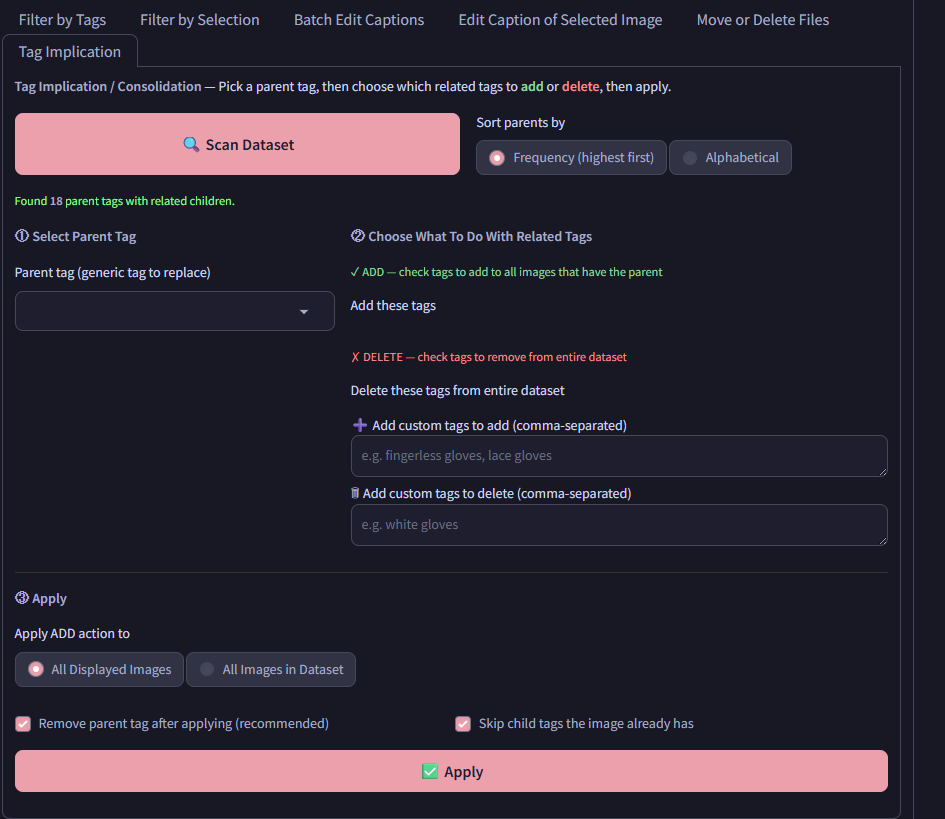
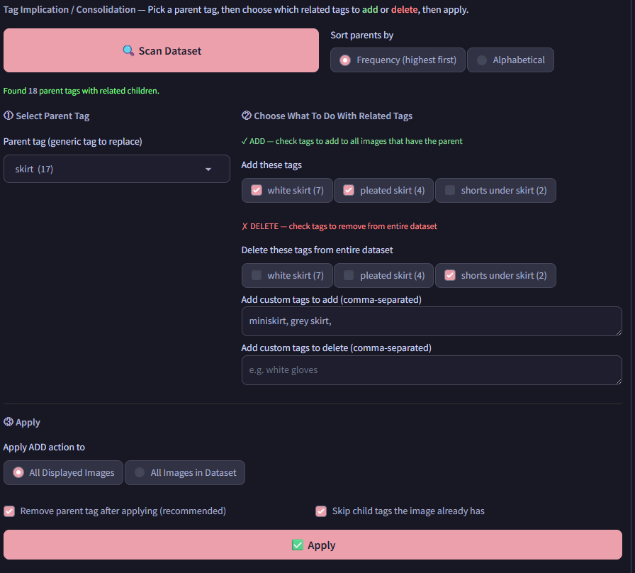
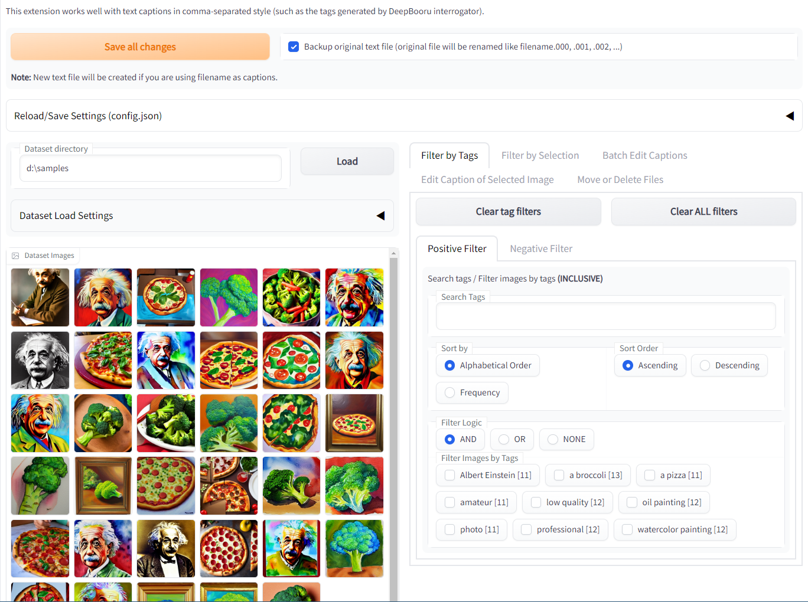
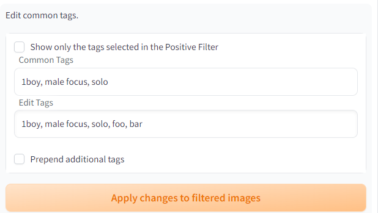
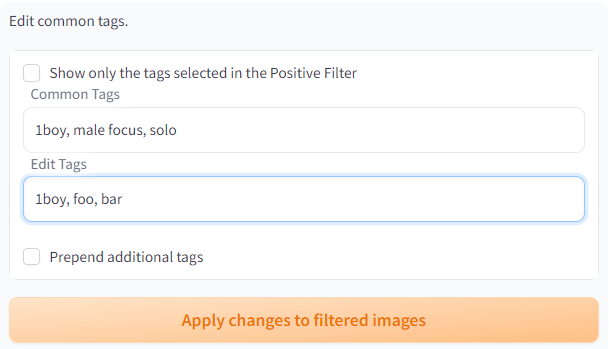
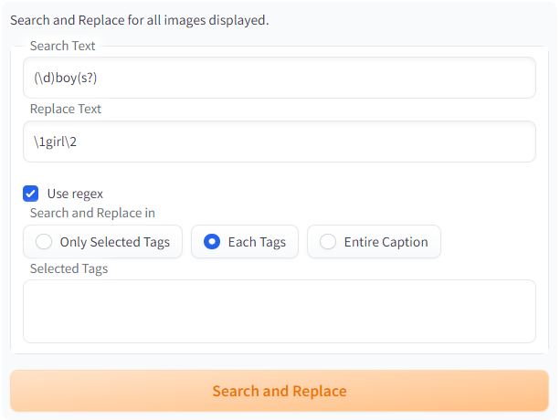
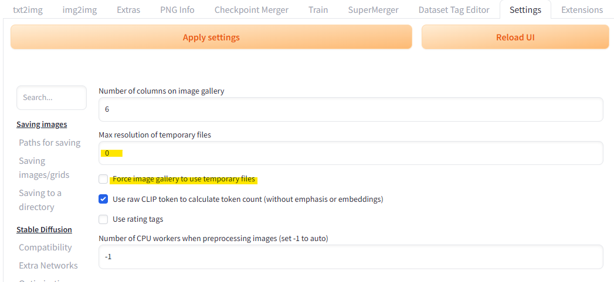

# Dataset Tag Editor Neo

Fork of [toshiaki1729/stable-diffusion-webui-dataset-tag-editor](https://github.com/toshiaki1729/stable-diffusion-webui-dataset-tag-editor) updated for compatibility with [Haoming02/sd-webui-forge-classic](https://github.com/Haoming02/sd-webui-forge-classic) (neo branch).

An extension to edit captions in training datasets for [SD WebUI Forge Neo](https://github.com/Haoming02/sd-webui-forge-classic).

Captions in image filenames can be loaded, but edited captions can only be saved as text files.

## Installation
### Extensions tab on WebUI
1. In Forge-Neo go to **Extensions → Install from URL**
2. Paste: `https://github.com/ikimiya/stable-diffusion-webui-dataset-tag-editor-forge-neo`
3. Click Install, then Apply and restart

**Please note that if you update this extension from "Extensions" tab, you will need to restart web UI to reload completely.**  

### Install Manually
To install, clone the repository into the `extensions` directory and restart the web UI.

On the web UI directory, run the following command to install:
```commandline
git clone https://github.com/ikimiya/stable-diffusion-webui-dataset-tag-editor-forge-neo extensions/dataset-tag-editor
```

> Tested on Forge-Neo (neo branch) · Gradio 4.40.0 · Python 3.13.12

## New Features

### Tag Implication 
This is an example of the new tab on load images.



**How to use:**
1. Click **Scan Dataset** to load tags
2. Select a parent tag — e.g. `skirt (17)`
3. Check tags to **add** — e.g. `white skirt (7)`, `pleated skirt (4)`
4. Check tags to **delete** — e.g. `shorts under skirt (2)`
5. Add custom tags if needed — e.g. `miniskirt, grey skirt`
6. Click **Apply**



After applying, all 17 images with `skirt` will gain `white skirt`, `pleated skirt`, `miniskirt`, and `grey skirt`. The parent tag is removed by default.

If you edit tags from another tab, click **Scan Dataset** again to refresh counts.

> **Tag Autocomplete For Tab**
> To enable autocomplete in the custom tag fields, open:
> `extensions\a1111-sd-webui-tagcomplete\javascript\_textAreas.js`
>
> Update the `dataset-tag-editor` selectors section (around line 20) to include the two new lines:
> ```javascript
> "dataset-tag-editor": {
>     "base": "#tab_dataset_tag_editor_interface",
>     "hasIds": false,
>     "selectors": [
>         "Caption of Selected Image",
>         "Interrogate Result",
>         "Edit Caption",
>         "Edit Tags",
>         "Add custom tags to add (comma-separated)",
>         "Add custom tags to delete (comma-separated)",
>     ]
> },
> ```

## Changes from Original

**Forge-Neo / A1111 compatibility**
- Removed `lowvram` module — Forge-Neo handles memory management automatically
- Removed `ldm` imports — unused 
- Added a local of A1111 `sd_hijack.py` — to replace missing `modules.sd_hijack`
- Added in `compat.py` — patches missing `shared.opts` settings at startup
- Fixed `shared.cmd_opts.use_cpu` reference
- Added null guard for `shared.sd_model.cond_stage_model` with word-split fallback for flux\anima
- `DeepDanbooru` tagger removed, forge doesn't use this 
- Fixed `read_wd_batchsize` missing large taggers `wd-eva02-large` and `wd-vit-large` etc.
- Restored missing tagger entries in `WD_TAGGERS_TIMM`

**Gradio 4 compatibility**
- Wrapped instance method callbacks with lambdas to fix input validation errors

**Dependencies**
- Added `install.py` — auto-installs `open-clip-torch` on startup

## Known Limitations
- DeepDanbooru tagger is disabled — use WD14 or EVA-02 instead
- Token counter uses word-split, not the exact tokens

---


*Original README below*

# Dataset Tag Editor
[**Stand alone version is here**](https://github.com/toshiaki1729/dataset-tag-editor-standalone): This may be better to avoid some known bugs.

**Due to gradio update on webUI, the latest version don't support old webUI.**  
Please see [Releases](https://github.com/toshiaki1729/stable-diffusion-webui-dataset-tag-editor/releases) page and check the compatibility with webUI you are using.

[日本語 Readme](README-JP.md)

This is an extension to edit captions in training dataset for [Stable Diffusion web UI by AUTOMATIC1111](https://github.com/AUTOMATIC1111/stable-diffusion-webui).



It works well with text captions in comma-separated style (such as the tags generated by DeepBooru interrogator).

Caption in the filenames of images can be loaded, but edited captions can only be saved in the form of text files.

## Installation
### Extensions tab on WebUI
Copy `https://github.com/toshiaki1729/stable-diffusion-webui-dataset-tag-editor.git` into "Install from URL" tab.

Also, if you see this extension listed, you can install from "Available" tab with a single click.

**Please note that if you update this extension from "Extensions" tab, you will need to restart web UI to reload completely.**  

### Install Manually
To install, clone the repository into the `extensions` directory and restart the web UI.

On the web UI directory, run the following command to install:
```commandline
git clone https://github.com/toshiaki1729/stable-diffusion-webui-dataset-tag-editor.git extensions/dataset-tag-editor
```

## Features
Note. "tag" means each blocks of caption separated by commas.
- Edit and save captions in text file (webUI style) or json file ([kohya-ss sd-scripts metadata](https://github.com/kohya-ss/sd-scripts))
- Edit captions while viewing related images
- Search tags
- Filter images to edit their caption by tags
  - AND/OR logic can be used in each Positive/Negative filters
- Batch replace/remove/append tags
- Batch sort tags
- Batch search and replace
  - [regular expression](https://docs.python.org/3/library/re.html#regular-expression-syntax) can be used
- Use interrogators
  - BLIP, BLIP2, GIT, DeepDanbooru, [Z3D-E621-Convnext](https://huggingface.co/toynya/Z3D-E621-Convnext), SmilingWolf's [WDv1.4 Tagger](https://huggingface.co/SmilingWolf) (v1, v2, v3 and some variants of them)
- You can add Custom Tagger in `userscripts/taggers` (they have to be wrapped by a class derived from `scripts.tagger.Tagger`)
  - Some Aesthetic Score Predictors are implemented in there
- Batch remove image and/or caption files


## Usage
1. Make dataset using web UI
    - better to use already cropped images
1. Load them
    - use interrogator if needed
1. Edit their captions
    - filter images you want to edit by tags in "Filter by Tags" tab
    - filter images manually in "Filter by Selection" tab
    - replace/remove tags or append new tags in "Batch Edit Captions" tab
    - edit captions individually in "Edit Caption of Selected Image" tab
      - you also can use interrogator here
    - move/delete files in "Move or Delete Files" tab if needed
1. Click "Save all changes" button


## By the way, how can I edit tags quickly?

Basic workflow is as follows:

1. Filter images
1. Batch edit

Please note that all batch editing will be applyed **only to displayed images (=filtered images)**.

### 1. Which filter is appropriate?
- **I want to edit all at once**  
  No filter is required.
- **Some images require editing**  
  1. **They should / shouldn't already have same tag(s)**  
    Go to "Filter by Tags" so that the only images to be edited are displayed.
  1. **They have nothing in common**  
    Go to "Filter by Selection" and apply.  
    Images can also be added to the filter by pushing [Enter] key.

### 2. How can I edit as I want?
- **I want to add some new tags**
  1. Go to "Batch Edit Captions" tab
  1. Append tags to "Edit tags" textbox
  1. Push "Apply changes to filtered images" button  
    
  "foo" and "bar" will be added to all images displayed.

- **I want to replace the tags which are common to displayed images**
  1. Go to "Batch Edit Captions" tab
  1. Replace tags in "Edit tags" textbox
  1. Push "Apply changes to filtered images" button  
    
  "male focus" and "solo" will be replaced with "foo" and "bar".

- **I want to remove some tags**  
  The same as replacing. Just replace the tags with "blank".  
  Also you can use "Remove" tab in "Batch Edit Captions".

- **I want to add/replace/remove tags more flexibly**
  1. Go to "Batch Edit Captions" tab
  2. Use "Search and Replace" with "Use regex" checked  
    
  "1boy", "2boys", … will be replaced with "1girl", "2girls", … in each tags of images displayed.  
  A comma will be regarded as the sepalator of two tags.  
  By using regex, you can add/replace/remove tags according to more complex conditions.


## Trouble shooting
### Cannot see any image in dataset and saying "All files must contained within the Gradio python app working directory…"
Set folder to store temporaly image in the "Settings" tab.
Input path in "Directory to save temporary files" and check "Force using temporary file…"

### So laggy when opening many images or extremely large image
Check "Force image gallery to use temporary files" and input number in "Maximum resolution of ..." in the "Settings" tab.  
It may not work with dataset with millions of images.  
If it doesn't work, please consider using [**stand alone version**](https://github.com/toshiaki1729/dataset-tag-editor-standalone).  
 


## Description of Display

Moved to [here](DESCRIPTION_OF_DISPLAY.md)